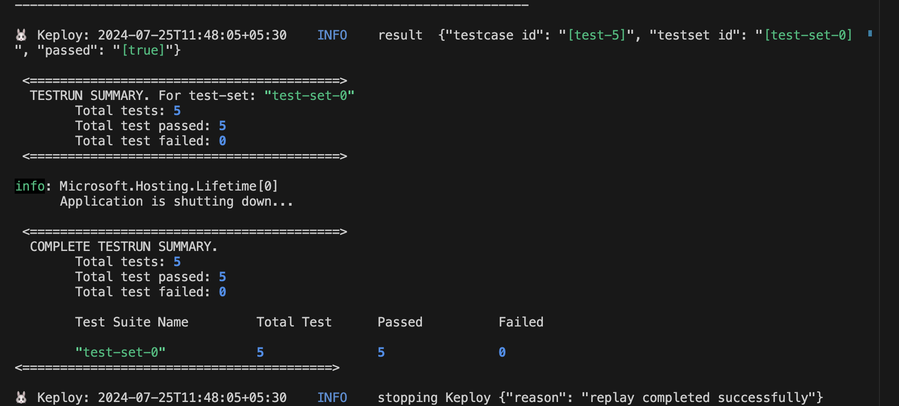

# Sample CRUD application

This is a sample C# application that demonstrates the usage of Keploy with .Net and PostgreSQl.

## Get Started with Keploy
1. Install Keploy
```bash
curl -O -L https://keploy.io/install.sh && source install.sh
```

2. Setup application
```sh
git clone https://github.com/keploy/samples-csharp.git

# start the database instance
docker-compose up
``` 

## Pre-requsites

Install `.Net EF` core library : 

```sh
dotnet tool install --global dotnet-ef
```
Once dotnet-ef is installed, ensure that PATH is updated : 
```sh
export DOTNET_ROOT=$HOME/.dotnet
export PATH="$HOME/.dotnet:$HOME/.dotnet/tools:$PATH"
export PATH="$PATH:$HOME/.dotnet/tools"

## Verify installation

dotnet ef --version
```

Check that your DbContext and entity configurations are correct, and run the following commands:

```sh
dotnet ef migrations add InitialMigration
dotnet ef database update
```
We need to run the migration command before starting our application.

### Running in record mode
```bash
keploy record -c "dotnet run"
```

Now, since we have our application up and running, let's perform few cURL requests :-

1. POST Requests :-
```sh
curl -k -X POST -H "Content-Type: application/json" -d '{"name":"Sarthak Shnygle","age":23}' http://localhost:5249/api/user

curl -k -X POST -H "Content-Type: application/json" -d '{"name":"Gourav Kumar","age":22}' http://localhost:5249/api/user
```

2. GET Request :-
```sh
curl -k http://localhost:5249/api/user
```

3. DELETE Request :-
```sh
curl -k -X DELETE http://localhost:5249/api/user/1
```

and voila, we have our testcases generated.


### Run the test cases

Now let's run the keploy in test mode : 

```sh
keploy test -c "dotnet run"
```

We can see that we have got our test-report generated and present in `Keploy/reports` under Keploy folder.

